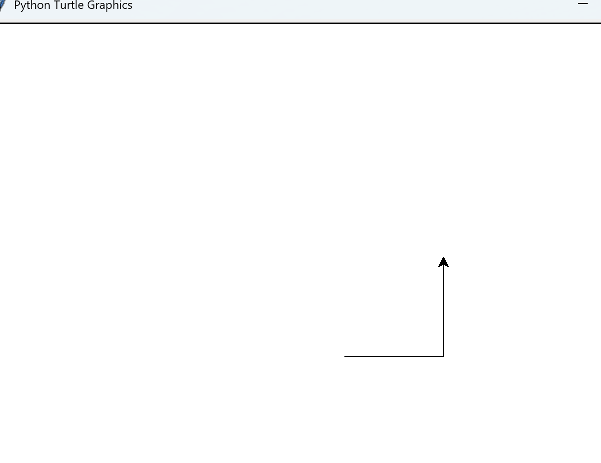
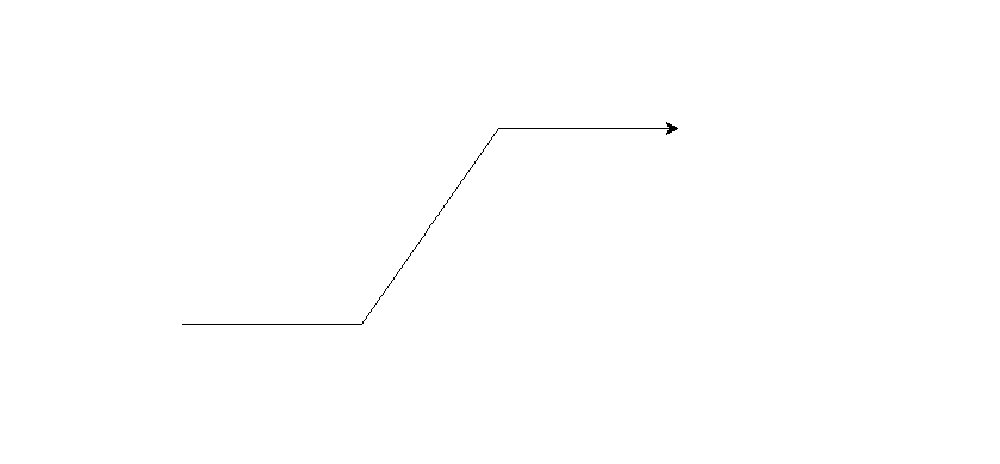
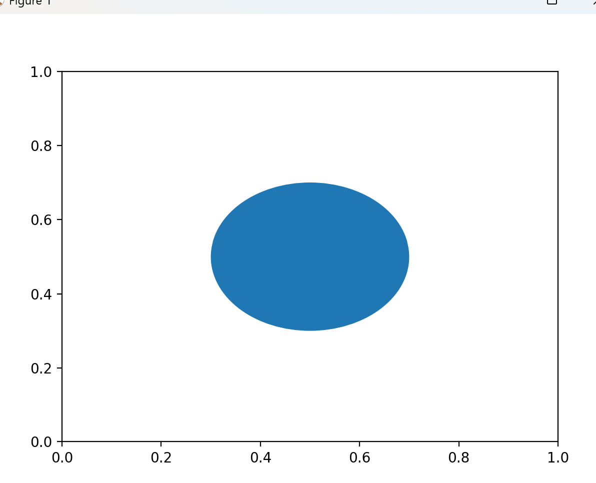
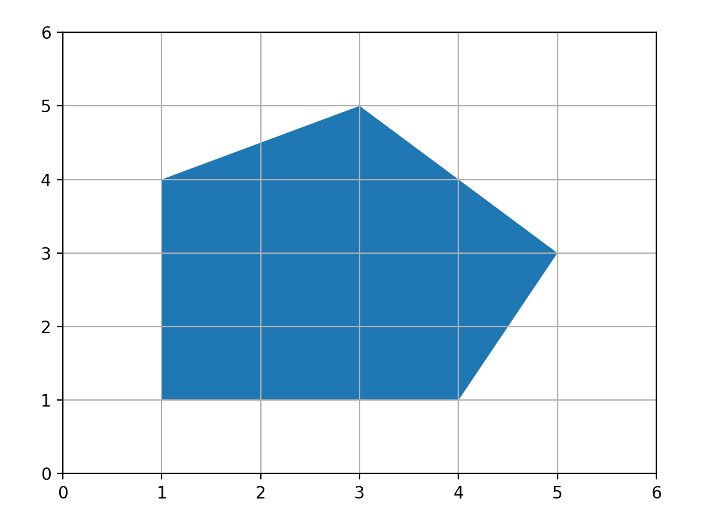

# Geometry Classes in Python

## Introduction

Geometry in Python is used in computer graphics, game development, CAD applications, GIS systems, simulations, machine learning, robotics, and mathematical modeling. Python provides many libraries that contain classes to work with points, lines, curves, surfaces, solids, and advanced geometrical structures.

This document explains the major geometry classes available in Python and how they are used.

---

# 1. Geometry Classes in Shapely Library

The Shapely library is one of the most popular Python libraries used for geometric operations.

## Installation

```python
pip install shapely
```

## Point Class

The `Point` class represents a single point in 2D space.

```python
from shapely.geometry import Point

p = Point(2, 3)
print(p)
print(p.x)
print(p.y)
```
## output
POINT (2 3)
2.0
3.0
### Uses

* Location mapping
* Coordinate systems
* GIS applications
* Distance calculations

---

## LineString Class

Represents a line formed using multiple coordinate points.

```python
from shapely.geometry import LineString

line = LineString([(0, 0), (2, 2), (3, 5)])
print(line.length)
```
## output
5.99070478491457
### Uses

* Roads in maps
* Path planning
* Shape boundaries

---

## Polygon Class

Used to create closed geometric shapes.

```python
from shapely.geometry import Polygon

poly = Polygon([(0,0), (4,0), (4,4), (0,4)])
print(poly.area)
print(poly.length)
```
## output:
16.0
16.0

### Uses

* Land areas
* Building structures
* Game regions

---

## MultiPoint Class

Stores multiple points together.

```python
from shapely.geometry import MultiPoint

points = MultiPoint([(1,2), (3,4), (5,6)])
print(points)
```
## output
MULTIPOINT ((1 2), (3 4), (5 6))


---

## MultiLineString Class

Represents multiple lines.

```python
from shapely.geometry import MultiLineString

ml = MultiLineString([
    [(0,0), (1,1)],
    [(2,2), (3,3)]
])
print(ml)
```
## output
MULTILINESTRING ((0 0, 1 1), (2 2, 3 3))

---

## MultiPolygon Class

Represents multiple polygons.

```python
from shapely.geometry import MultiPolygon
from shapely.geometry import Polygon

p1 = Polygon([(0,0), (1,0), (1,1), (0,1)])
p2 = Polygon([(2,2), (3,2), (3,3), (2,3)])

mp = MultiPolygon([p1, p2])
print(mp)
```
## output
MULTIPOLYGON (((0 0, 1 0, 1 1, 0 1, 0 0)), ((2 2, 3 2, 3 3, 2 3, 2 2)))
---

## GeometryCollection Class

Stores mixed geometry types.

```python
from shapely.geometry import GeometryCollection, Point, LineString

collection = GeometryCollection([
    Point(1,2),
    LineString([(0,0), (1,1)])
])

print(collection)
```
## output 
GEOMETRYCOLLECTION (POINT (1 2), LINESTRING (0 0, 1 1))
---

# 2. Geometry Classes in SymPy Geometry Module

SymPy provides symbolic geometry classes.

## Installation

```python
pip install sympy
```

---

## Point Class

```python
from sympy.geometry import Point

p1 = Point(0, 0)
p2 = Point(4, 5)

print(p1.distance(p2))
```
## output
sqrt(41)
---

## Line Class

```python
from sympy.geometry import Point, Line

p1 = Point(0, 0)
p2 = Point(2, 2)

line = Line(p1, p2)
print(line)
```
## output
Line2D(Point2D(0, 0), Point2D(2, 2))

---

## Segment Class

Represents a line segment.

```python
from sympy.geometry import Segment, Point

s = Segment(Point(0,0), Point(5,5))
print(s.length)
```
## output
5*sqrt(2)

---

## Ray Class

Represents a ray extending infinitely.

```python
from sympy.geometry import Ray, Point

ray = Ray(Point(0,0), Point(1,1))
print(ray)
```
## output
Ray2D(Point2D(0, 0), Point2D(1, 1))
---

## Circle Class

```python
from sympy.geometry import Circle, Point

circle = Circle(Point(0,0), 5)
print(circle.area)
```
## output

25*pi
---

## Triangle Class

```python
from sympy.geometry import Triangle, Point

triangle = Triangle(
    Point(0,0),
    Point(4,0),
    Point(0,3)
)

print(triangle.area)
```
## output
6
---

## Ellipse Class

```python
from sympy.geometry import Ellipse, Point

ellipse = Ellipse(Point(0,0), 5, 3)
print(ellipse.area)
```
## output
15*pi
---

## Polygon Class

```python
from sympy.geometry import Polygon, Point

poly = Polygon(
    Point(0,0),
    Point(4,0),
    Point(4,4),
    Point(0,4)
)

print(poly.area)
```

## output
16
---

# 3. Geometry Classes in Turtle Graphics

Python Turtle is used for drawing geometric shapes.

## Installation

Turtle comes pre-installed with Python.

---

## Turtle Class

```python
import turtle

t = turtle.Turtle()

t.forward(100)
t.left(90)
t.forward(100)

turtle.done()
```
## output


import turtle

t = turtle.Turtle()

t.forward(150)
t.left(55)
t.forward(200)
t.right(55)
t.forward(150)

turtle.done()
## output

### Uses

* Educational geometry
* Drawing shapes
* Animations

---

# 4. Geometry Classes in Pygame

Pygame is used for 2D graphics and game geometry.

## Installation

```python
pip install pygame
```

---

## Rect Class

Represents rectangular objects.

```python
import pygame

rect = pygame.Rect(10, 20, 100, 50)
print(rect.width)
print(rect.height)
```
## output
100
50

### Uses

* Collision detection
* Player movement
* UI components

---

# 5. Geometry Classes in Matplotlib

Matplotlib provides geometry-related plotting objects.

## Installation

```python
pip install matplotlib
```

---

## Circle Patch

```python
import matplotlib.pyplot as plt
from matplotlib.patches import Circle

fig, ax = plt.subplots()

circle = Circle((0.5, 0.5), 0.2)
ax.add_patch(circle)

plt.show()
```
## output

---

## Rectangle Patch

```python
from matplotlib.patches import Rectangle

rect = Rectangle((0.1,0.1), 0.5, 0.3)
print(rect)
```
## output

Rectangle(xy=(0.1, 0.1), width=0.5, height=0.3, angle=0)
---

## Polygon Patch

```python
import matplotlib.pyplot as plt
from matplotlib.patches import Polygon

# Create figure and axis
fig, ax = plt.subplots()

# Polygon points
points = [
    (1, 1),
    (4, 1),
    (5, 3),
    (3, 5),
    (1, 4)
]

# Create polygon
poly = Polygon(points, closed=True)

# Add polygon to graph
ax.add_patch(poly)

# Set graph limits
plt.xlim(0, 6)
plt.ylim(0, 6)

# Show grid
plt.grid()

# Display polygon
plt.show()
```
## output


---


# # Important Geometry Concepts in Python

## 2D Geometry

* Points
* Lines
* Curves
* Polygons
* Circles
* Ellipses

## 3D Geometry

* Meshes
* Solids
* Surfaces
* Point Clouds
* Voxels

---

# 10. Applications of Geometry Classes

| Geometry Type | Applications          |
| ------------- | --------------------- |
| Point         | GIS, Mapping          |
| Line          | Roads, Navigation     |
| Polygon       | Buildings, Land Areas |
| Circle        | Simulations, Graphics |
| Mesh          | 3D Modeling           |
| Surface       | Engineering           |
| Solid         | CAD Software          |
| Point Cloud   | AI Vision             |

---

# 11. Advantages of Using Geometry Libraries

* Easy mathematical operations
* Accurate geometric calculations
* Visualization support
* Useful in AI and graphics
* Supports 2D and 3D geometry
* Helpful for simulations and gaming

---

# 12. Conclusion

Python provides powerful geometry libraries for handling points, lines, curves, surfaces, solids, and advanced geometrical structures. Libraries such as Shapely, SymPy, Open3D, Trimesh, Matplotlib, Turtle, and SciPy make geometry operations easier and more efficient.

These geometry classes are widely used in:

* Artificial Intelligence
* Robotics
* Computer Graphics
* CAD Systems
* GIS Applications
* Simulations
* Data Visualization
* Game Development
